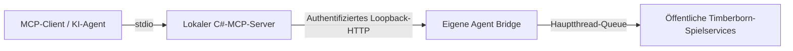

# Timberborn MCP

Eine eigene Timberborn-Mod und ein lokaler C#-MCP-Server ermöglichen einem KI-Agenten,
das Spiel strukturiert zu beobachten und über reguläre Spielaktionen zu steuern.
Ziel ist ein Agent, der Wasser, Nahrung, Holz, Wege und Wohnraum aufbaut und betreibt.

**Entwicklungsstand: Agent Bridge 0.21.0**, gebaut gegen Timberborn **1.1.2.4 / Folktails**.
**0.21.0 ergänzt den Produktionsgraphen und enthält die Lebenszustandskorrektur aus 0.20.1; Installation/Live-Abnahme stehen aus.**
0.20.0 ist noch installiert; dessen 29 Leser waren live geprüft. Ein Folgepilot zeigte,
dass registrierte verstorbene Biber bislang mitgezählt wurden.
Neu: Bedürfnisübersicht, Biber-Bedürfnisdetails und Gebäudebetriebsdiagnose.
Bedürfnis- und Betriebsbelege sind an konkreten Bibern, Erfinder, Farm und Pumpen bestätigt. 40 registrierte Güter
und Lagerwarnungen mit betroffenen Zielen sind bestätigt. Weitere Warnungstypen bleiben zu prüfen.
Die Güterhistorie ist über einen Tageswechsel und die Sofort-Wegsuche einschließlich
Unterbrechung/Wiederaufbau live bestätigt. Der direkte Terrainzugriff liefert im Live-Pilot
485 Zellen für die Farm und 611 für den Holzfäller; erste und letzte Seite geprüft.
478 reguläre Tests bestehen (465 Unit, 13 Integration).
Die Basisaktionen funktionieren; zuverlässiges autonomes Koloniemanagement ist noch in Entwicklung.

**Keine zusätzliche Spielmod erforderlich.** Die eigene Mod hat `RequiredMods: []`.
More HTTP API, ModdableTimberborn, TimberUi, Mod Settings und Harmony sind keine
Pflichtabhängigkeiten. Ein älterer More-HTTP-API-Adapter bleibt für Vergleich und
Regression im Repository; [Referenzen und Legacy-Abgrenzung](docs/references/README.md).

## Was bereits funktioniert

| Bereich | Implementierter Umfang |
| --- | --- |
| Bedürfnisse/Betrieb (0.20.0) | Native Warn-/Kritisch-Flags, Bedürfniswerte, Personal/Arbeitszeit sowie Rezept-, Zutaten-, Brennstoff- und Produktplatzbelege; gezielte Live-Piloten bestanden |
| Produktionsgraph (0.21.0) | Ein MCP-Abruf für Güter, Rezeptketten, Gebäude/Baukosten, Energie und Schnitt-/Sammelquellen; [Umfang und Grenzen](docs/production-dependency-graph.md), Live-Abnahme offen |
| Zustand | Bevölkerung, Betten, vollständiger Güterleser, aktive Status mit Zielen, Karte, Gebäude, Baustellen, Arbeiterzuordnung |
| Logistik | Gebäudezugang, Sofort-Wegsuche einschließlich Unterbrechung, Farm-/Holzfällerreichweiten und Güterhistorie über Tageswechsel live bestätigt |
| Bauen | Vorlagenkatalog, Kosten/Freischaltung, räumliche Vorprüfung, Spielvalidierung, reguläre Bauaufträge |
| Betrieb | Gebäudepause, Sollbesetzung, Arbeitsplatz-/Bauprioritäten, Lagerwahl und Lagermodi |
| Flächen | Anbau und Baumfällmarkierungen, Pflanzmarkierungen, Kiefernschutz durch Entfernen von Fällmarkierungen |
| Entfernen | Getrennte Gebäude-, Schutt- und Vegetationsaktionen mit begrenzten Einzelzielen |
| Forschung | Punkte und Kosten lesen; Gebäude regulär gegen Forschungspunkte freischalten |
| Simulation | Pause sowie 1×, 3× und 7× |
| Nachvollziehbarkeit | Ingame-MCP-Log, optionale kurze Aktionsbegründung, feste fachliche Fehlercodes |

29 Lesewerkzeuge und 19 separat freizugebende Werkzeuge für Aktionen/Vorschauvalidierung
sind im nativen Katalog implementiert. Die beiden frühen Baupiloten sind weiterhin
vorhanden; für neue Bauaufgaben dienen die generischen Werkzeuge.
[Werkzeugübersicht und Freigaben](docs/tools.md).

Live nachgewiesen sind unter anderem regulärer Gebäudebau, Wasserlagerung, ein
Karotten-Anbau-/Erntezyklus und Forschungsproduktion mit bezahlter Freischaltung.
Das bestätigt konkrete Abläufe, nicht jede Vorlage, Fraktion oder eine dauerhaft
tragfähige Versorgung. Die neuen [Güter-/Statusleser](docs/economy-observations.md) ergänzen die
bisherige Water/Berries/Log-Kurzansicht. Vollständige UI-Meldungsabdeckung,
die vollständige Diagnose von Produktionsblockaden und Erreichbarkeit in weiteren Sonderfällen bleiben [offen](BACKLOG.md).

## Aufbau



MCP läuft über stdio. HTTP ist der lokale interne Transport unserer eigenen Mod,
keine Abhängigkeit von der Fremdmod More HTTP API. Spielsteuerung erfolgt ausschließlich
programmiert über Spielservices, ohne Screenshot-Auswertung oder simulierte Eingaben.

## Einstieg

Benötigt: Timberborn, .NET SDK gemäß [global.json](global.json), für den Mod-Build die
Bibliotheken der eigenen Spielinstallation. Die Spielbibliotheken werden nicht mitgeliefert.

```powershell
# Server bauen und normale Tests ausführen; kein Spielzugriff:
pwsh -NoProfile -File ./scripts/verify.ps1

# Eigenes Mod-Paket gegen die installierten Spielbibliotheken bauen:
pwsh -NoProfile -File ./scripts/build-native-bridge.ps1 `
  -TimberbornManagedDir '<Spielverzeichnis>/Timberborn_Data/Managed'

# MCP ausdrücklich nativ und lesend starten:
pwsh -NoProfile -File ./scripts/start-native.ps1 `
  -ConfigPath '<installierte Mod>/bridge.local.json'
```

[Installation und MCP-Client-Einrichtung](docs/native-bridge-install.md) beschreiben
Paket, private Konfiguration und optionale Aktionsfreigaben. Ohne passende Freigaben
in **Mod und MCP-Prozess** werden die Aktionen nicht ausgeführt. Der Lesestarter setzt
alle Aktionsschalter ausdrücklich auf aus.

## Projektnavigation

- [Projektstand und Nachweise](PROJECT_STATE.md)
- [Mission und Abnahmeziele](missionsplan.md)
- [Priorisierte offene Arbeiten](BACKLOG.md)
- [Entwicklung, Tests und Updates](DEVELOPMENT_WORKFLOW.md)
- [Aktuelle Architektur](docs/architecture/native-game-api.md)
- [Fachdokumentation](docs/README.md)
- [Chronologisches Projektjournal](docs/project-journal.md) und [historischer Missionsverlauf](docs/history/missionsplan-2026-09-20.md)
- [Agentenanweisungen](AGENTS.md)

Quellcode: [MIT-Lizenz](LICENSE). Bibliotheken und Referenzen behalten ihre eigenen
[Lizenzbedingungen](THIRD-PARTY-NOTICES.md). Inoffizielles Projekt; Timberborn stammt von Mechanistry.
